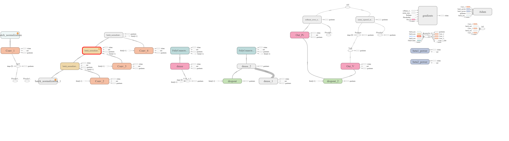

# Game AI framework with NNet.
## Структура проекта
Общая структура проекта:

    ProjectName
        |
        | - framework
        |      |
        |      | - Arena.py
        |      | - Coach.py
        |      | - Game.py
        |      | - MCTS.py
        |      | - NeuralNet.py
        |      | - utils.py
        |
        | - othello
        |      |
        |      | - images
        |      |     |
        |      |     | - black.png
        |      |     | - gray.png
        |      |     | - white.png
        |      |
        |      | - tensorflow
        |      |     |
        |      |     | - NNet.py
        |      |     | - OthelloNNet.py
        |      |
        |      | - OthelloArena.py
        |      | - OthelloGame.py
        |      | - OthelloLogic.py
        |      | - OthelloPlayers.py
        |
        | - pretrained_models
        |      |
        |      | - tic_tac_toe
        |      |     |
        |      |     | - tttmodel_name
        |      |
        |      | - othello
        |      |     |
        |      |     | - othellomodel_name
        |      
        | - tic_tac_toe
        |      |
        |      | - images
        |      |     |
        |      |     | - circle.bmp
        |      |     | - cross.bmp
        |      |     | - empty.png
        |      |
        |      | - tensorflow
        |      |     |
        |      |     | - NNet.py
        |      |     | - TicTacToeNNet.py
        |      |
        |      | - TicTacToeArena.py
        |      | - TicTacToeGame.py
        |      | - TicTacToeLogic.py
        |      | - TicTacToePlayers.py
        |      
        | - utils
        |      |
        |      | - images
        |      |     |
        |      |     | - cifar.png
        |      |     | - imagenet.png
        |      |
        |      | - progress
        |      |     |
        |      |     | - progress
        |      |     |      |
        |      |     |      | - __init__.py
        |      |     |      | - bar.py
        |      |     |      | - counter.py
        |      |     |      | - helpers.py
        |      |     |      | - spinner.py
        |      |     |
        |      |     | - __init__.py
        |      |     | - demo.gif
        |      |     | - LICENSE
        |      |     | - MANIFEST.in
        |      |     | - README.rst
        |      |     | - setup.py
        |      |     | - test_progress.py
        |      |
        |      | - __init__.py
        |      | - eval.py
        |      | - logger.py
        |      | - misc.py
        |
        | - .gitignore
        | - main.py
        | - othello_pit.py
        | - README.md
        | - tic_tac_toe_pit.py

В корне проекта, в папке
 
    framework\

содержатся базовые классы:

* *Arena* - класс, описывающий арену, в которой любые два агента могут сразиться друг с другом.
* *Game* - класс, описывающий базовый класс для игры.
* *MCTS* - класс для метода поиска Монте - Карло в дереве.
* *Coach* - класс, описывающий процесс self-play игры нейронной сети и ее обучение.
* *NeuralNet* - класс, описывающий базовый класс для нейронной сети.
* *utils* - вспомогательный класс, дающий возможность обращаться к элементам словаря через ".".

Данный фреймворк будет работать для любой антогонистической пошаговой игры, состояния которой могут быть представлены в виде матрицы.
Такими играми являются, например, реверси, крестики - нолики, го, шашки, шахматы и т.д.
Игра обязательно должна быть антогонистической и пошаговой.

При написании игры %GameName% следует создать несколько классов:

* *%GameName%Arena* - класс, описывающий арену для конкретной игры. Является потомком базового класса *Arena*.
* *%GameName%Game* - класс, описывающий логику игры. Является потомком базового класса *Game*.
* *%GameName%Logic* - модуль, содержащий описание класса *Board*, который в свою очередь является описанием доски игры.
* *%GameName%Players* - модуль, содержащий в себе описания классов агентов, играющий в игру %GameName%.
* *NNet* - модуль, содержащий в себе описание класса *NNetWrapper*, описывающего обертку вокруг нейронной сети, имплементируя методы тренировки, предсказания, загрузки и сохранения. Является потомком базового класса *NeuralNet*.
* *%GameName%NNet* - класс, описывающий конкретную нейронную сеть для конкретной игры.

А так же создать модуль %GameName%_pit.py, в котором будут происходить сражения между агентами.
Пример того, как это делается, например, для игр реверси и крестики - нолики можно посмотреть в папках 
    
    othello\
    tic_tac_toe\
    
соответственно.

В папках
    
    othello\images
    tic_tac_toe\images
    
хранятся рисунки фигур, используемых в пользовательском интерфейсе.

В папках

    othello\tensorflow
    tic_tac_toe\tensorflow
    
хранятся нейронные сети для игры и обертки для нее.
Предназначение *%GameName%* - файлов описано выше.

В папках 

    pretrained_models\tic_tac_toe
    pretrained_models\othello

хранятся уже натренированные модели для соответствующих игр. С ними можно играть из коробки.
    
В папке

    utils\
    
находятся модули для реализации консольной графики, отображающей процесс выполнения обучения (прогресс бары и т.п.).
Позволяют облегчить процесс наблюдения за обучением нейронной сети.

Модуль

    main.py
    
запускает процесс обучения нейронной сети с заданными параметрами.

Для запуска игры с заданными агентами используются файлы *%GameName%_pit.py*

## Системные требования

Используйте Python 3.x. Лучше всего поставить Анаконду для Python 3.6.
Информацию об Анаконде можно найти по ссылке: https://www.anaconda.com/

Библиотеки, используемые в проекте:

* tensorflow (tensorflow-gpu)
* numpy  
* pygame

Учтите, что если будете использовать tensorflow-gpu, то у вас должен быть видеоадаптер от компании Nvidia.

## Выбор архитектуры нейронной сети (Реверси)
Сверточная нейронная сеть обычно представляет собой чередование сверточных слоев, субдескритизирующих слоев и, при наличии, полносвязных слоев на выходе.
Выбор архитектуры нейронной сети не самая тривиальная задача в рамках неисследованной задачи.
Для уменьшенния вычислительной нагрузки и ускорения процесса обучения было решено обучать сеть для игры 6х6.
    
В процессе выбора архитектуры было опробовано несколько вариантов сетей (различное количество слоев, глобальные параметры: скорость обучения, дропаут и т.д.). 
В связи с ограниченностью времени было подготовлено 5 различных архитектур(модели не сохранились). 
Для проверки эффективности сети проводилось 10 итераций обучения для каждой, а затем все сети учавствовали в импровизированном турнире. 
По итогу была выбрана архитектура победившей сети.

Архитектура этой сети состоит из четырех последовательных сверточных и двух полносвязных слоев.
Для сверточных и полносвязных слоев функцией активации является ReLU. 
Для выходного слоя параметра v в качестве функции активации используется гиперболический тангенс.
Визуализация данной архитектуры представлена на рисунке ниже с помощью утилиты tensorboard.
Информацию о тензорборде можно найти по ссылке: https://www.tensorflow.org/get_started/summaries_and_tensorboard
 
## Граф сети

## Полезные ссылки
Вводная статья на Хабре про tensorflow: 
* https://habrahabr.ru/company/ods/blog/324898/

Статьи про метод Монте - Карло поиска в дереве:
* https://habrahabr.ru/post/282522/
* https://habrahabr.ru/post/330092/

Статья про метод стохастического градиентного спуска:
* http://www.machinelearning.ru/wiki/index.php?title=%D0%9C%D0%B5%D1%82%D0%BE%D0%B4_%D1%81%D1%82%D0%BE%D1%85%D0%B0%D1%81%D1%82%D0%B8%D1%87%D0%B5%D1%81%D0%BA%D0%BE%D0%B3%D0%BE_%D0%B3%D1%80%D0%B0%D0%B4%D0%B8%D0%B5%D0%BD%D1%82%D0%B0

Статья о batch normalization:
* http://proceedings.mlr.press/v37/ioffe15.pdf

Статья про методы оптимизации нейронных сетей (обязательно нужно почитать про Adam optimizer):
* https://habrahabr.ru/post/318970/

В кратце про Alpha Zero:
* http://web.stanford.edu/~surag/posts/alphazero.html

Подробнее про AlphaGo/AlphaZero:
* http://airesearch.com/wp-content/uploads/2016/01/deepmind-mastering-go.pdf
* https://www.gwern.net/docs/rl/2017-silver.pdf

Вводная статья о сверточных нейронных сетях:
* https://habrahabr.ru/post/309508/